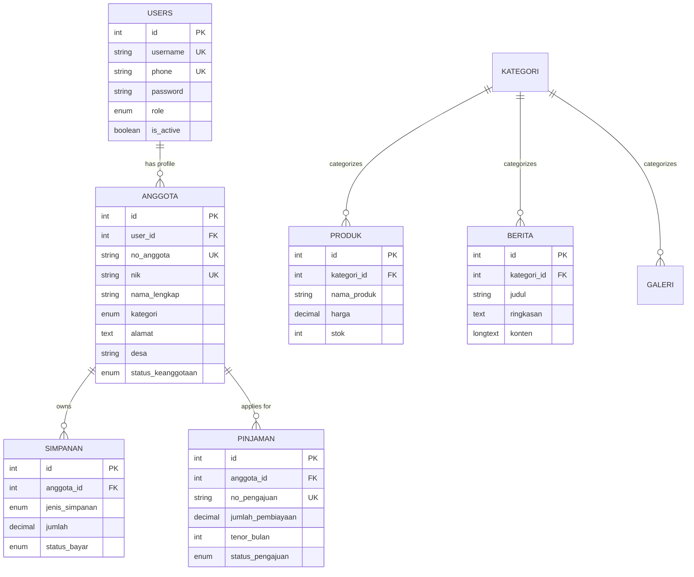

# Entity Relationship Diagram (ERD) - Koperasi Tani Pangan Mandiri

Visualisasi rancangan relasi basis data menggunakan diagram Mermaid.

```mermaid
erDiagram
    USERS ||--o{ ANGGOTA : "has profile"
    ANGGOTA ||--o{ SIMPANAN : "owns"
    ANGGOTA ||--o{ PINJAMAN : "applies for"
    KATEGORI ||--o{ PRODUK : "categorizes"
    KATEGORI ||--o{ BERITA : "categorizes"
    KATEGORI ||--o{ GALERI : "categorizes"

    USERS {
        int id PK
        string username UK
        string phone UK
        string password
        enum role
        boolean is_active
    }

    ANGGOTA {
        int id PK
        int user_id FK
        string no_anggota UK
        string nik UK
        string nama_lengkap
        enum kategori
        text alamat
        string desa
        enum status_keanggotaan
    }

    SIMPANAN {
        int id PK
        int anggota_id FK
        enum jenis_simpanan
        decimal jumlah
        enum status_bayar
    }

    PINJAMAN {
        int id PK
        int anggota_id FK
        string no_pengajuan UK
        decimal jumlah_pembiayaan
        int tenor_bulan
        enum status_pengajuan
    }

    PRODUK {
        int id PK
        int kategori_id FK
        string nama_produk
        decimal harga
        int stok
    }

    BERITA {
        int id PK
        int kategori_id FK
        string judul
        text ringkasan
        longtext konten
    }
```
